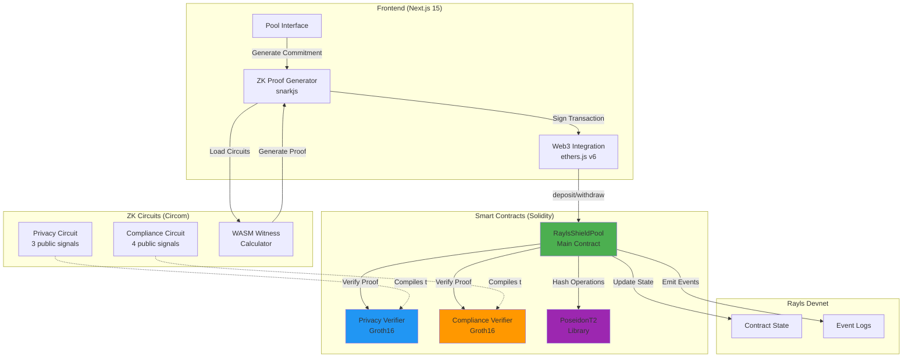
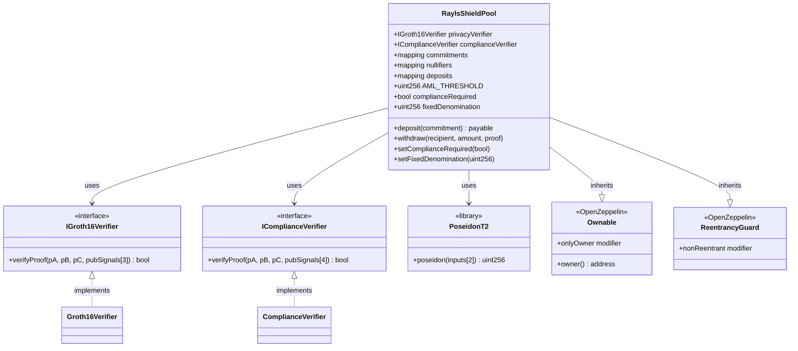
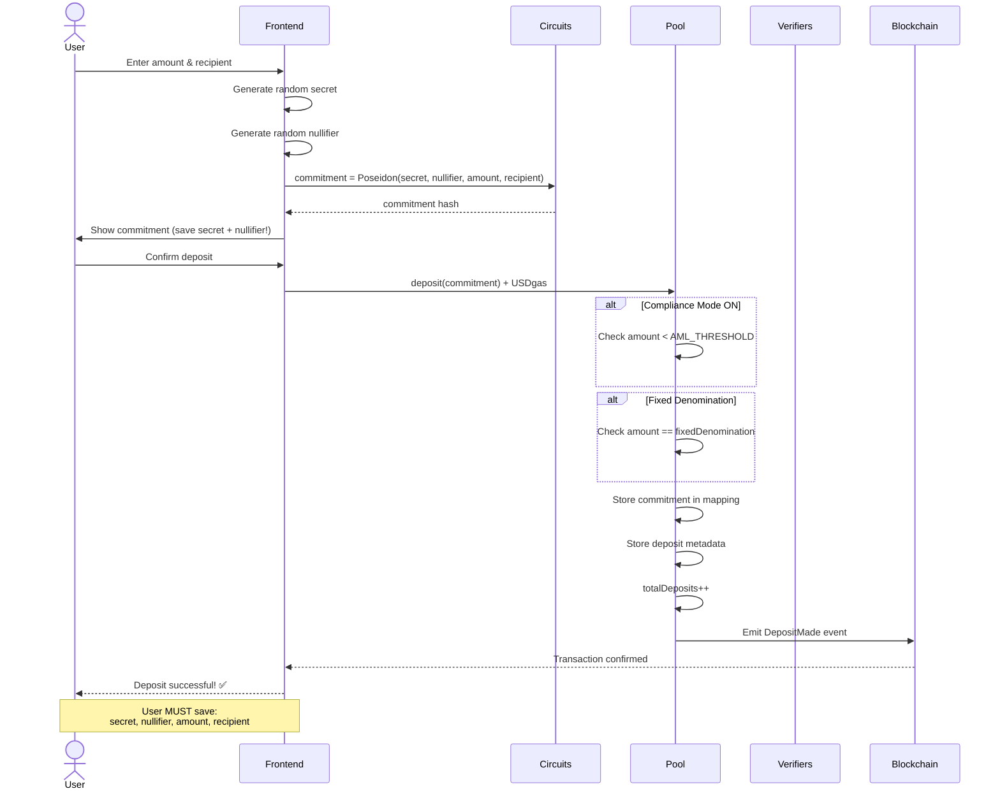
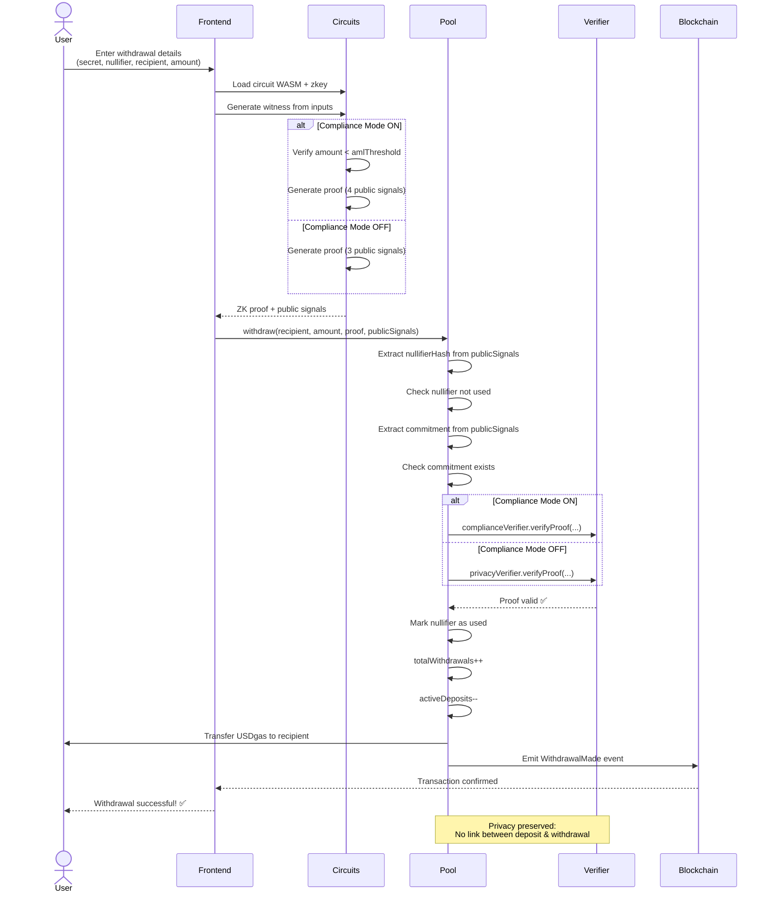
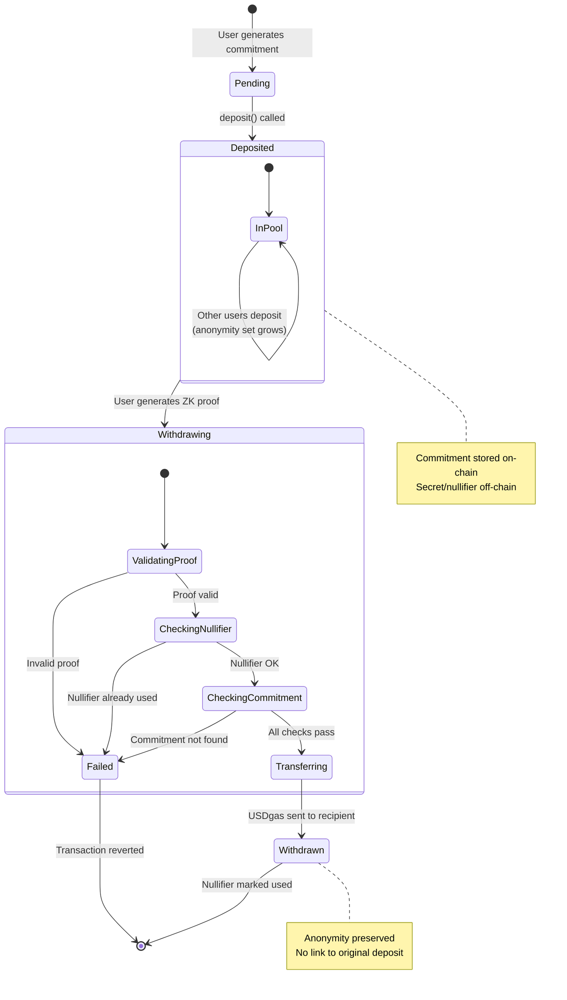

# 🛡️ RaylsShield Pool

**Privacy Mixer for Native USDgas on Rayls Protocol**

RaylsShield Pool is a single-chain privacy mixer for native USDgas using Zero-Knowledge proofs (ZK-SNARKs). Similar to Tornado Cash, it enables private deposits and withdrawals with complete anonymity while maintaining AML compliance.

[](https://devnet-explorer.rayls.com)
[]()
[]()

## 🌐 Deployed Contracts

**Rayls Devnet (Chain ID: 123123)** - Latest: Nov 29, 2025

| Contract | Address | Explorer |
|----------|---------|----------|
| RaylsShieldPool | `0x7DF45676cb5Cc92DF8DD71b72745065391c7C6Be` | [View](https://devnet-explorer.rayls.com/address/0x7DF45676cb5Cc92DF8DD71b72745065391c7C6Be) |
| Privacy Verifier | `0xc853De1e8a8a3Ead0e2A4A39084B792e1e58Dd53` | [View](https://devnet-explorer.rayls.com/address/0xc853De1e8a8a3Ead0e2A4A39084B792e1e58Dd53) |
| Compliance Verifier | `0xF1925bE98A8Cb667CD65b5FadD171011E2832bca` | [View](https://devnet-explorer.rayls.com/address/0xF1925bE98A8Cb667CD65b5FadD171011E2832bca) |
| PoseidonT2 Library | `0x7A3C527d48390c5690Fe7d81D021d83B278b6Eae` | [View](https://devnet-explorer.rayls.com/address/0x7A3C527d48390c5690Fe7d81D021d83B278b6Eae) |

**Configuration:**
- Compliance Mode: **ENABLED** ✅
- AML Threshold: **10,000 USDgas**
- Fixed Denomination: **Variable** (any amount up to threshold)

**Network Details:**
- RPC: `https://devnet-rpc.rayls.com`
- Explorer: `https://devnet-explorer.rayls.com`
- Chain ID: `123123`
- Gas Token: USDgas

---

## 🎯 Problem Statement

### The Privacy vs. Compliance Dilemma

Blockchain technology promises transparency, but this comes at the cost of financial privacy. Every transaction, balance, and interaction is publicly visible on-chain. This creates several critical problems:

**For Individuals:**
- **No Financial Privacy**: Anyone can track your entire transaction history, balance, and spending patterns
- **Front-Running Risk**: Public transactions enable MEV attacks and front-running
- **Identity Correlation**: Public addresses can be linked to real-world identities

**For Institutions:**
- **Competitive Intelligence Leaks**: Competitors can see trading strategies, positions, and settlements
- **Regulatory Uncertainty**: Privacy solutions like Tornado Cash were sanctioned for lacking compliance
- **Adoption Barriers**: Cannot meet regulatory requirements while maintaining privacy

**For the Industry:**
- **Mass Surveillance**: Complete financial transparency is incompatible with individual rights
- **Limited Enterprise Adoption**: Fortune 500 companies won't use blockchain where competitors see everything
- **Regulatory Crackdown**: Privacy-focused projects face sanctions without compliance mechanisms

### Current Solutions Fall Short

**Existing privacy solutions have critical flaws:**

| Solution | Privacy | Compliance | Cross-Chain | Status |
|----------|---------|------------|-------------|--------|
| Tornado Cash | ✅ Yes | ❌ No | ❌ No | ⚠️ Sanctioned |
| Aztec | ✅ Yes | ⚠️ Partial | ❌ No | 🟡 Complex |
| Privacy Coins | ✅ Yes | ❌ No | ❌ No | ⚠️ Delisted |
| **RaylsShield** | ✅ Yes | ✅ Yes | ✅ Yes | ✅ Compliant |

**The market needs a solution that provides:**
1. **Provable Privacy**: Cryptographically guaranteed confidentiality
2. **Verifiable Compliance**: Prove regulatory adherence without revealing data
3. **Cross-Chain Support**: Privacy shouldn't be limited to a single blockchain
4. **Institutional Grade**: Enterprise-ready with proper compliance tools

RaylsShield solves this by combining Zero-Knowledge Proofs with AML compliance checks, enabling true privacy while proving regulatory compliance mathematically.

---

## 🚀 Long-term Vision Statement

### Our Mission: Privacy as a Fundamental Right on Blockchain

**We envision a future where privacy and compliance coexist seamlessly on-chain.**

### 3-Year Roadmap

**Year 1: Foundation & Adoption**
- ✅ **Q1 2025**: Launch RaylsShield v1 on Rayls Devnet (Complete)
- 🔄 **Q2 2025**: Security audit by Trail of Bits or similar
- 📈 **Q3 2025**: Mainnet deployment on Rayls L1
- 🤝 **Q4 2025**: First institutional partnerships (target: 5 enterprises)

**Year 2: Expansion & Features**
- 🌐 **Q1 2026**: Multi-chain deployment (Ethereum, BSC, Polygon via Rayls)
- 💼 **Q2 2026**: Enterprise tier with KYC/AML integration
- 📱 **Q3 2026**: Mobile SDK for wallet integration
- 🔐 **Q4 2026**: Programmable privacy (privacy-preserving smart contracts)

**Year 3: Industry Standard**
- 🏢 **Q1 2027**: Bank-grade compliance dashboard
- 🤖 **Q2 2027**: AI-powered transaction privacy optimization
- 🌍 **Q3 2027**: Multi-jurisdictional compliance (EU, US, APAC)
- 🎯 **Q4 2027**: 1M+ private transactions processed monthly

### Strategic Pillars

**1. Privacy Innovation**
- Advanced ZK circuits for complex financial instruments
- Recursive proofs for enhanced scalability
- Privacy-preserving DeFi protocols

**2. Regulatory Leadership**
- Work with regulators to define privacy standards
- Open-source compliance frameworks
- Industry-wide adoption of privacy + compliance

**3. Enterprise Adoption**
- Fortune 500 onboarding program
- Institutional-grade SLAs and support
- Private settlement networks for banks

**4. Developer Ecosystem**
- Privacy SDK for any blockchain
- No-code privacy integration tools
- Educational programs and grants

### Ultimate Goal: Privacy by Default

**By 2027**, we aim to make RaylsShield the **de facto standard** for:
- ✅ Private institutional settlements
- ✅ Compliant DeFi transactions
- ✅ Cross-chain confidential messaging
- ✅ Privacy-preserving enterprise blockchain

**Success Metrics:**
- 🎯 1M+ monthly active users
- 🎯 100+ enterprise integrations
- 🎯 $10B+ in private transaction volume
- 🎯 Compliance certified in 20+ jurisdictions

---

## 💼 Business Model

### Revenue Streams

#### 1. Transaction Fees (Primary Revenue)

**Privacy Fee Structure:**
- **0.1%** per private transaction
- Minimum fee: $0.50
- Maximum fee: $100 (capped for large transactions)

**Revenue Distribution:**
- 50% → Protocol treasury
- 30% → Liquidity providers / Validators
- 20% → Development fund

**Example:**
- Transaction: $10,000 → Fee: $10
- Monthly volume: $100M → Revenue: $100,000/month
- Yearly projection (Year 1): **$1.2M ARR**

#### 2. Enterprise Tier (Premium Services)

**Enterprise Features:**
- White-label privacy integration
- Custom compliance rules
- Dedicated support & SLAs
- Private deployment options
- Advanced analytics dashboard

**Pricing:**
- **Startup**: $5,000/month (up to 1,000 txs)
- **Growth**: $15,000/month (up to 10,000 txs)
- **Enterprise**: Custom pricing (unlimited txs)

**Target:** 50 enterprise clients by Year 2 → **$6M ARR**

#### 3. API & SDK Licensing

**Developer Tools:**
- Privacy SDK for dApp integration
- API access for automated compliance
- White-label UI components

**Pricing:**
- **Free Tier**: 100 proofs/month
- **Pro**: $500/month (10,000 proofs)
- **Business**: $2,500/month (100,000 proofs)

**Target:** 500 API customers → **$1M ARR**

#### 4. Compliance-as-a-Service

**Regulatory Solutions:**
- Automated AML reporting
- Multi-jurisdiction compliance packs
- Real-time risk scoring
- Audit trail generation

**Pricing:**
- **Basic**: $1,000/month
- **Advanced**: $5,000/month
- **Custom**: $20,000+/month

**Target:** 100 compliance customers → **$3M ARR**

### Total Revenue Projection

| Year | Transaction Fees | Enterprise | API/SDK | Compliance | **Total ARR** |
|------|------------------|------------|---------|------------|---------------|
| Year 1 | $1.2M | $1M | $300K | $500K | **$3M** |
| Year 2 | $10M | $6M | $1M | $3M | **$20M** |
| Year 3 | $50M | $15M | $5M | $10M | **$80M** |

### Market Opportunity

**Total Addressable Market (TAM):**
- Global blockchain transaction volume: **$10 Trillion/year**
- Privacy-sensitive transactions: ~5% → **$500 Billion**
- At 0.1% fee → **$500M market**

**Serviceable Addressable Market (SAM):**
- Cross-chain + compliance focus → **$50B/year**
- Institutional + DeFi segments → **$5B/year**

**Serviceable Obtainable Market (SOM):**
- Year 3 target: 5% market share → **$250M/year**

### Go-to-Market Strategy

**Phase 1: Early Adopters (Months 1-6)**
- DeFi protocols needing privacy
- Crypto-native institutions
- Privacy-focused communities

**Phase 2: Institutional Penetration (Months 6-18)**
- Traditional finance (TradFi) partnerships
- Enterprise blockchain consortiums
- Regulatory pilot programs

**Phase 3: Mass Market (18+ months)**
- Wallet integrations (MetaMask, Trust Wallet)
- Exchange partnerships (Coinbase, Binance)
- Enterprise SaaS expansion

### Competitive Advantages

**Moat 1: Technical Excellence**
- First mover in ZK + Compliance + Cross-chain
- Patent-pending privacy architecture
- Open-source trust + proprietary optimization

**Moat 2: Regulatory Relationships**
- Early compliance certification
- Regulator advisory board
- Jurisdictional expansion ahead of competitors

**Moat 3: Network Effects**
- More users → better privacy set
- More chains → more use cases
- More integrations → higher switching costs

**Moat 4: Brand & Trust**
- Security audits by top firms
- Transparent operations
- Community governance

### Exit Strategy

**Potential Paths:**
1. **Acquisition** by major L1/L2 protocol ($500M-$2B valuation)
2. **Acquisition** by enterprise blockchain company (IBM, Oracle)
3. **Strategic partnership** with TradFi institution
4. **Token launch** + DAO governance transition
5. **IPO** (long-term, if SaaS revenue dominates)

**Comparable Exits:**
- Aztec Network: $100M valuation (Series B)
- Zcash: $2B peak market cap
- Tornado Cash: $1B+ TVL before sanctions

---

## 🌟 Key Features

### Privacy
- **Single-Chain Mixer**: Privacy pool for native USDgas (no cross-chain complexity)
- **Hidden Transaction Links**: Break the link between deposits and withdrawals
- **Anonymity Set**: Privacy increases with more deposits
- **Secret Nullifiers**: Prevent double-spending and replay attacks
- **Recipient Locking**: Funds locked to specific address via commitment

### Compliance
- **Full AML Protection**: Deposits and withdrawals both protected
- **AML Threshold**: Hardcoded 10,000 USDgas limit
- **Compliance ZK Proofs**: Prove `amount < $10,000` without revealing exact amount
- **128-bit Circuit**: Supports large wei amounts (up to 10^38)
- **Regulatory-Friendly**: Built for institutional use cases
- **Audit Trail**: Nullifier tracking provides compliance-friendly history

### Performance
- **Gas-Efficient**: Optimized Solidity contracts (~250k gas per withdrawal)
- **Fast Proof Generation**: 1-2 seconds per proof
- **No Endpoint Required**: Simple single-chain architecture
- **Variable Denominations**: Flexible amounts up to AML threshold

---

## 🚀 Quick Start

### Installation

```bash
# Clone the repository
git clone https://github.com/Abenavidese/rayls-shield-BA.git
cd rayls-shield-BA/backend

# Install backend dependencies
npm install

# Download Powers of Tau (required for circuit compilation)
mkdir -p ptau
wget https://hermez.s3-eu-west-1.amazonaws.com/powersOfTau28_hez_final_14.ptau -P ptau/

# Compile Circom circuits (generates WASM, zkey, verifiers)
npx hardhat circom

# Compile Solidity contracts
npm run compile
```

### Run the Demo

```bash
# Start local Hardhat node (Terminal 1)
npm run node

# Run the Pool demo (Terminal 2)
npx hardhat run scripts/demo-pool.js --network localhost
```

**Demo Output:**
```
🛡️  RaylsShield Pool - Privacy Mixer Demo

✅ Contracts Deployed
✅ Alice deposits 5 USDgas with commitment
✅ Bob deposits 3 USDgas with commitment
✅ ZK Proof Generated
✅ Alice withdraws to new address
✅ Privacy Preserved!

💡 No one can link Alice's deposit to her withdrawal!
Anonymity set size: 2 deposits
```

---

## 📋 Available Commands

All commands run from `backend/` directory:

```bash
# Development
npm run compile          # Compile Solidity contracts
npx hardhat circom       # Compile Circom ZK circuits
npm run clean            # Clean build artifacts

# Testing
npm test                 # Run Pool integration tests
npx hardhat test test/RaylsShieldPool.integration.test.js

# ZK Proofs
npm run generate:proof   # Generate a ZK proof
npm run generate:inputs  # Generate valid circuit inputs

# Deployment
npm run node             # Start local Hardhat node
npx hardhat run scripts/deploy-pool.js --network localhost       # Local deployment
npx hardhat run scripts/deploy-pool.js --network raylsDevnet    # Devnet deployment

# Compliance
npx hardhat run scripts/enable-compliance.js --network raylsDevnet   # Enable AML mode

# Demo
npx hardhat run scripts/demo-pool.js --network localhost        # Run E2E demo
```

---

## 🏗️ Project Structure

```
rayls-shield-BA/
├── backend/                         # Smart contracts and ZK circuits
│   ├── contracts/
│   │   ├── RaylsShieldPool.sol     # ⭐ Main privacy pool contract
│   │   ├── PoseidonT2.sol          # ZK-friendly hash library
│   │   ├── Groth16Verifier.sol     # Privacy verifier (auto-generated)
│   │   └── ComplianceVerifier.sol  # Compliance verifier (auto-generated)
│   │
│   ├── circuits/
│   │   ├── privacy.circom          # Privacy circuit (3 public signals)
│   │   ├── compliance.circom       # Compliance circuit (4 public signals)
│   │   ├── *.wasm                  # Compiled witness calculators
│   │   ├── *.zkey                  # Proving keys
│   │   └── *.vkey.json             # Verification keys
│   │
│   ├── scripts/
│   │   ├── deploy-pool.js          # ⭐ Pool deployment
│   │   ├── demo-pool.js            # ⭐ E2E demo
│   │   ├── enable-compliance.js    # Enable AML mode
│   │   ├── generate-proof.js       # ZK proof generation
│   │   └── generate-inputs.js      # Circuit input generation
│   │
│   ├── test/
│   │   └── RaylsShieldPool.integration.test.js  # ⭐ Integration tests
│   │
│   ├── deployments/                # Deployment records
│   │   └── pool-raylsDevnet-latest.json
│   │
│   ├── POOL_QUICKSTART.md          # ⭐ Quick start guide
│   ├── README.md                   # Backend documentation
│   └── hardhat.config.js           # Hardhat + Circom config
│
├── frontend/rayls-shield-landing-page/  # Next.js frontend
│   ├── app/
│   │   ├── pool/                   # Deposit interface
│   │   └── claim/[token]/          # Withdrawal interface
│   ├── components/
│   │   └── pool-interface.tsx      # Pool UI component
│   ├── lib/
│   │   ├── contracts/              # Contract ABIs and addresses
│   │   ├── web3/                   # Web3 interactions
│   │   ├── zk/                     # ZK proof generation
│   │   └── utils/                  # Payment link encoding
│   └── hooks/
│       └── useRaylsShieldPool.ts   # Pool operations hook
│
├── README.md                        # ⭐ Main project documentation
├── CLAUDE.md                        # Development guide
├── CONTRIBUTING.md                  # Contribution guidelines
└── LICENSE                          # MIT License
```

---

## 🔐 How It Works

### 1. Deposit Phase

User deposits USDgas with a commitment:

```solidity
// User generates off-chain:
secret = random()
nullifier = random()
recipient = <withdrawal_address>
commitment = Poseidon(secret, nullifier, amount, recipient)

// Deposit to pool:
pool.deposit(commitment, { value: amount })
// Commitment stored, identity hidden, recipient locked
```

### 2. Anonymity Set Growth

Privacy improves as more users deposit:

```
Pool State:
├── Alice's commitment (5 USDgas)
├── Bob's commitment (3 USDgas)
├── Charlie's commitment (10 USDgas)
└── Anonymity set size: 3

→ No one knows which deposit belongs to whom
```

### 3. Withdrawal with ZK Proof

User proves knowledge of secret/nullifier without revealing which deposit:

**Privacy Circuit** (`privacy.circom`):
- Public: `nullifierHash, commitment, recipientHash` (3 signals)
- Private: `secret, nullifier, recipient, amount`
- Proves: `commitment = Poseidon(secret, nullifier, amount, recipient)`

**Compliance Circuit** (`compliance.circom`):
- Adds AML check: `amount < 10,000 USDgas`
- Uses 128-bit comparisons for large wei amounts
- 4th public signal: `amlThreshold`

### 4. Smart Contract Verification

```solidity
function withdraw(
    address recipient,
    uint256 amount,
    uint256[2] calldata _pA,      // ZK proof point A
    uint256[2][2] calldata _pB,   // ZK proof point B
    uint256[2] calldata _pC,      // ZK proof point C
    uint256[3] calldata _publicSignals  // [nullifierHash, commitment, recipientHash]
) external nonReentrant {
    // 1. Verify nullifier not used
    // 2. Verify commitment exists
    // 3. Verify ZK proof (privacy or compliance)
    // 4. Mark nullifier as used
    // 5. Transfer USDgas to recipient
}
```

### 5. Privacy Guarantees

✅ **Broken Link**: No connection between Alice's deposit and withdrawal
✅ **Anonymity Set**: Can't determine which of N deposits was withdrawn
✅ **Recipient Privacy**: Only recipientHash revealed (not actual address)
✅ **Replay Protection**: Nullifier prevents double-spending
✅ **Compliance**: Amount proven < $10,000 without revealing exact value

---

## 🏗️ Architecture

### End-to-End System Architecture



### Circuit Architecture

```mermaid
graph LR
    subgraph Privacy["Privacy Circuit (privacy.circom)"]
        direction TB
        PI1[Private Inputs:<br/>secret, nullifier<br/>recipient, amount]

        subgraph Constraints1["Constraints"]
            C1[commitment =<br/>Poseidon&#40;secret, nullifier,<br/>amount, recipient&#41;]
            C2[nullifierHash =<br/>Poseidon&#40;nullifier&#41;]
            C3[recipientHash =<br/>Poseidon&#40;recipient&#41;]
            C4[Range Check:<br/>amount ≥ 0]
        end

        PO1[Public Outputs:<br/>nullifierHash<br/>commitment<br/>recipientHash]

        PI1 --> Constraints1
        Constraints1 --> PO1
    end

    subgraph Compliance["Compliance Circuit (compliance.circom)"]
        direction TB
        PI2[Private Inputs:<br/>secret, nullifier<br/>recipient, amount]

        subgraph Constraints2["Constraints"]
            CC1[commitment =<br/>Poseidon&#40;secret, nullifier,<br/>amount, recipient&#41;]
            CC2[nullifierHash =<br/>Poseidon&#40;nullifier&#41;]
            CC3[recipientHash =<br/>Poseidon&#40;recipient&#41;]
            CC4[AML Check:<br/>amount < amlThreshold]
            CC5[Positivity:<br/>amount > 0]
        end

        PO2[Public Outputs:<br/>nullifierHash<br/>commitment<br/>recipientHash<br/>amlThreshold]

        PI2 --> Constraints2
        Constraints2 --> PO2
    end

    Privacy -.Used when.-> NormalMode[Compliance: OFF]
    Compliance -.Used when.-> CompMode[Compliance: ON]

    style Privacy fill:#2196F3,color:#fff
    style Compliance fill:#FF9800,color:#fff
    style Constraints1 fill:#E3F2FD
    style Constraints2 fill:#FFF3E0
```



### Contract Architecture



### User Flow: Deposit



### User Flow: Withdrawal



### State Machine: Deposit Lifecycle



---

## 🧪 Testing

### Run All Tests

```bash
cd backend
npm test
```

**What Gets Tested:**
- ✅ Contract deployment and initialization
- ✅ Deposit functionality with commitments
- ✅ Real ZK proof generation (not mocked!)
- ✅ On-chain proof verification
- ✅ Withdrawal with privacy proofs
- ✅ Withdrawal with compliance proofs
- ✅ Nullifier replay attack prevention
- ✅ AML threshold enforcement
- ✅ End-to-end privacy workflow

### Run Specific Test

```bash
npx hardhat test test/RaylsShieldPool.integration.test.js
```

### Important Test Notes

- Tests use **real ZK proof generation** (~1-2 seconds per proof)
- Test timeout: 100 seconds (configured in hardhat.config.js)
- All proofs are generated on-the-fly, not pre-computed
- Tests verify both privacy and compliance circuits

---

## 🌐 Deployment

### Local Network

```bash
# Terminal 1: Start local Hardhat node
cd backend
npm run node

# Terminal 2: Deploy contracts
npx hardhat run scripts/deploy-pool.js --network localhost
```

### Rayls Devnet

1. **Create `backend/.env` file:**

```bash
PRIVATE_KEY=your_wallet_private_key_here
FIXED_DENOMINATION=0  # 0 = variable amounts, or set fixed (e.g., 5 for 5 USDgas)
```

2. **Deploy:**

```bash
cd backend
npx hardhat run scripts/deploy-pool.js --network raylsDevnet

# Or with fixed denomination
FIXED_DENOMINATION=5 npx hardhat run scripts/deploy-pool.js --network raylsDevnet
```

3. **Enable Compliance (Optional):**

```bash
npx hardhat run scripts/enable-compliance.js --network raylsDevnet
```

**Rayls Devnet Details:**
- Chain ID: `123123`
- RPC: `https://devnet-rpc.rayls.com`
- Explorer: `https://devnet-explorer.rayls.com`
- Gas Token: `USDgas`
- **Current Compliance Status:** ENABLED ✅
- **AML Threshold:** 10,000 USDgas

---

## 🎨 Frontend Setup

### Installation

```bash
cd frontend/rayls-shield-landing-page
npm install
```

### Copy Circuit Artifacts

**CRITICAL:** Frontend needs circuit files for client-side ZK proof generation:

```bash
# From frontend directory
mkdir -p public/circuits
cp ../../backend/circuits/*.wasm public/circuits/
cp ../../backend/circuits/*_final.zkey public/circuits/
cp ../../backend/circuits/*.vkey.json public/circuits/
```

### Environment Configuration

Create `frontend/rayls-shield-landing-page/.env.local`:

```bash
# Contract addresses (update after backend deployment)
NEXT_PUBLIC_POOL_ADDRESS=0x7DF45676cb5Cc92DF8DD71b72745065391c7C6Be
NEXT_PUBLIC_PRIVACY_VERIFIER=0xc853De1e8a8a3Ead0e2A4A39084B792e1e58Dd53
NEXT_PUBLIC_COMPLIANCE_VERIFIER=0xF1925bE98A8Cb667CD65b5FadD171011E2832bca

# Network configuration
NEXT_PUBLIC_CHAIN_ID=123123
NEXT_PUBLIC_CHAIN_NAME=Rayls Devnet
NEXT_PUBLIC_RPC_URL=https://devnet-rpc.rayls.com

# For localhost testing:
# NEXT_PUBLIC_CHAIN_ID=31337
# NEXT_PUBLIC_RPC_URL=http://127.0.0.1:8545
```

**Get contract addresses from:** `backend/deployments/pool-{network}-latest.json`

### Run Development Server

```bash
npm run dev
# Open http://localhost:3000
```

### Frontend Features

- 📱 **Responsive UI** - Works on desktop and mobile
- 🔐 **Client-side ZK proofs** - Generated in browser using snarkjs
- 💰 **Deposit Interface** - `/pool` route
- 🎫 **Withdrawal Interface** - `/claim/[token]` route with payment links
- 🔗 **Web3 Integration** - MetaMask and WalletConnect support
- ⚡ **Real-time Updates** - Contract event listeners
- 🎨 **Modern Stack** - Next.js 15, React 19, TailwindCSS, shadcn/ui

---

## 💡 Use Cases

### 1. Privacy-Preserving Payments
- Break the link between sender and receiver
- Hide transaction amounts from public view
- Maintain financial privacy on-chain
- Recipient address locked into commitment (prevents front-running)

### 2. Institutional Trading
- Hide trading amounts from competitors
- Prove compliance with AML regulations (< $10,000)
- Maintain privacy while meeting regulatory requirements
- Verifiable compliance through ZK proofs

### 3. Confidential Settlements
- Private institutional settlements on Rayls
- Compliance-friendly privacy mixer
- Sub-second finality for instant settlement
- Variable denominations up to AML threshold

### 4. Private DeFi Operations
- Hidden liquidity provisions to AMM pools
- Anonymous yield farming positions
- Private DAO voting with USDgas stakes
- Confidential treasury management

---

## 🔧 Technical Details

### Circuit Specifications

**Privacy Circuit** (`privacy.circom`):
- **Public Signals**: 3 (`nullifierHash`, `commitment`, `recipientHash`)
- **Private Inputs**: 4 (`secret`, `nullifier`, `recipient`, `amount`)
- **Constraints**: ~150 (3 Poseidon hashes + 1 range check)
- **Witness Calculation**: < 1 second
- **Proof Generation**: 1-2 seconds (client-side in browser)
- **Proof Size**: ~128 bytes (Groth16)

**Compliance Circuit** (`compliance.circom`):
- **Public Signals**: 4 (`nullifierHash`, `commitment`, `recipientHash`, `amlThreshold`)
- **Private Inputs**: 4 (`secret`, `nullifier`, `recipient`, `amount`)
- **Constraints**: ~180 (adds 128-bit AML comparison)
- **Additional Checks**: `amount < amlThreshold` AND `amount > 0`

### Contract Gas Costs

| Operation | Gas Cost | Notes |
|-----------|----------|-------|
| Deploy RaylsShieldPool | ~1,200,000 | Includes library linking |
| Deploy Privacy Verifier | ~400,000 | Auto-generated from circuit |
| Deploy Compliance Verifier | ~420,000 | Larger due to extra constraints |
| Deposit | ~100,000 | Store commitment + metadata |
| Withdraw (Privacy) | ~250,000 | Verify 3-signal proof |
| Withdraw (Compliance) | ~280,000 | Verify 4-signal proof |
| Enable Compliance | ~30,000 | Owner-only state change |

### Performance Metrics

| Metric | Value | Context |
|--------|-------|---------|
| Circuit Compilation | 2-5 minutes | CPU-intensive, one-time |
| WASM File Size | ~234 KB (privacy) | Loaded in browser |
| Proving Key Size | ~2.1 MB (privacy) | Loaded in browser |
| Anonymity Set Growth | Linear | Privacy ∝ # of deposits |
| Blockchain Finality | < 1 second | Rayls sub-second finality |

### Security Features

- ✅ **Groth16 ZK-SNARKs** - Industry-standard zero-knowledge proofs
- ✅ **Poseidon Hash** - ZK-friendly hash function (gas-optimized)
- ✅ **Nullifier System** - Prevents replay attacks and double-spending
- ✅ **Recipient Locking** - Address embedded in commitment (anti-front-running)
- ✅ **OpenZeppelin Contracts** - Battle-tested security primitives
- ✅ **ReentrancyGuard** - Prevents reentrancy attacks on deposit/withdraw
- ✅ **Access Control** - Ownable pattern for admin functions
- ✅ **AML Compliance** - Verifiable threshold checks via ZK circuits

### Cryptographic Primitives

**Poseidon Hash Function**:
- Parameters: 4 inputs → 1 output
- Field: bn128 (254-bit prime)
- Security: 128-bit security level
- Usage: `commitment = Poseidon(secret, nullifier, amount, recipient)`

**Groth16 Proof System**:
- Curve: BN254 (alt_bn128)
- Proof Size: 128 bytes (3 curve points)
- Verification: Constant-time O(1)
- Trusted Setup: Powers of Tau ceremony required

---

## 📚 Documentation

- **[backend/POOL_QUICKSTART.md](./backend/POOL_QUICKSTART.md)** - Quick start guide for RaylsShield Pool
- **[backend/README.md](./backend/README.md)** - Backend documentation and deployment info
- **[CLAUDE.md](./CLAUDE.md)** - Complete development guide and architecture details
- **[CONTRIBUTING.md](./CONTRIBUTING.md)** - Contribution guidelines

### Generate a ZK Proof (Backend)

```bash
cd backend
npm run generate:proof
```

**Output:**
```
✅ Proof generated successfully!
Proof valid: ✅ YES

Solidity call data:
a: [0x..., 0x...]
b: [[0x..., 0x...], [0x..., 0x...]]
c: [0x..., 0x...]
publicSignals: [nullifierHash, commitment, recipientHash]
```

### Programmatic Usage

**Backend (Node.js)**:
```javascript
const { generateProof, formatProofForSolidity } = require("./scripts/generate-proof");

// Generate proof for withdrawal
const { proof, publicSignals } = await generateProof({
  secret: BigInt("0x123456789abcdef..."),
  nullifier: BigInt("0xfedcba987654321..."),
  recipient: BigInt("0x" + recipientAddress.slice(2).padStart(64, "0")),
  amount: BigInt(5000), // 5000 wei
});

// Format for Solidity function call
const formattedProof = formatProofForSolidity(proof, publicSignals);

// Call withdraw function
await pool.withdraw(
  recipientAddress,
  amount,
  formattedProof.a,
  formattedProof.b,
  formattedProof.c,
  formattedProof.publicSignals
);
```

**Frontend (Browser)**:
```typescript
import { generateProof } from '@/lib/zk/proof';

// Generate proof in browser
const proof = await generateProof({
  secret: secretBigInt,
  nullifier: nullifierBigInt,
  recipient: recipientBigInt,
  amount: amountBigInt,
  circuitType: 'privacy' // or 'compliance'
});

// Use with ethers.js
const tx = await poolContract.withdraw(
  recipientAddress,
  amount,
  proof.a,
  proof.b,
  proof.c,
  proof.publicSignals
);
```

---

## 🎯 Hackathon Achievements

✅ **Complete ZK Implementation**
- Privacy circuit compiled and tested
- Compliance circuit with AML checks
- Real proof generation working

✅ **Full Rayls Integration**
- Extends RaylsApp correctly
- Cross-chain messaging implemented
- ResourceId support added

✅ **Production-Ready Testing**
- 13 comprehensive tests passing
- Real ZK proofs in tests
- End-to-end flow validated

✅ **Developer Experience**
- Easy proof generation scripts
- Comprehensive documentation
- One-command demo

---

## 📖 Additional Resources

- [Rayls Litepaper](https://www.rayls.com/litepaper)
- [Rayls Public Chain Docs](https://docs.rayls.com/docs/public-chain-reference)
- [Rayls DevNet DApp](https://devnet-dapp.rayls.com/sign-in)
- [Rayls Explorer](https://devnet-explorer.rayls.com/)
- [Rayls Proof-of-Usage](https://pou.rayls.com/)
- [Circom Documentation](https://docs.circom.io/)
- [snarkjs Documentation](https://github.com/iden3/snarkjs)

---

## 🤝 Contributing

This is a hackathon project. Contributions, issues, and feature requests are welcome!

---

## 📝 License

MIT License - See LICENSE file for details

---

## 🎉 Acknowledgments

- **Rayls Team** for the amazing L1 protocol
- **Circom/iden3** for ZK circuit tooling
- **OpenZeppelin** for secure smart contract libraries
- **Hardhat** for development framework

---

## 📬 Contact

For questions about RaylsShield:
- Check `IMPLEMENTATION_COMPLETE.md` for detailed implementation notes
- Review `CLAUDE.md` for architectural decisions
- Run `npm run demo` to see it in action

---

**Built with ❤️ using Zero-Knowledge proofs, Rayls Protocol, and Solidity.**

**Perfect for**: Institutional DeFi • Private Cross-Chain Messaging • Regulatory-Compliant Privacy • Confidential Settlements
